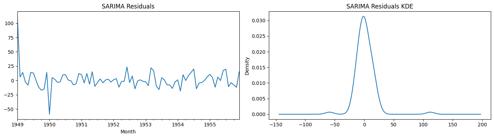

# 📈 Time Series Analysis using ARIMA & SARIMA
### Forecasting Monthly Airline Passenger Demand

[](https://www.python.org/)
[](https://www.statsmodels.org/)
[](https://jupyter.org/)
[](https://opensource.org/licenses/MIT)

---

## 📌 Project Overview

This project performs a complete end-to-end **time series forecasting pipeline** on the classic **Box-Jenkins Airline Passengers dataset**. The dataset records the monthly number of international airline passengers (in thousands) from **January 1949 to December 1960** — 144 monthly observations across 12 years.

The core goal is to build, validate, and compare two forecasting models:

- **ARIMA** — AutoRegressive Integrated Moving Average (non-seasonal baseline)
- **SARIMA** — Seasonal ARIMA (the recommended model for this dataset)

The project follows the full **Box-Jenkins methodology**: stationarity testing → differencing → ACF/PACF order selection → model fitting → diagnostic checking → forecasting.

---

## 🗂️ Repository Structure

```
Mdkamrulislam54-Time-Series-Analysis-using-SARIMA/
│
├── Time_Series_Analysis_using_SARIMA.ipynb   # Main Jupyter notebook (full analysis)
├── airline_passengers.csv                    # Dataset (144 monthly observations)
├── Residuals.png                             # SARIMA residual diagnostics plot
├── ARIMA vs SARIMA.png                       # Model comparison forecast plot
└── 5 Year Forecasted.png                     # SARIMA 5-year future forecast plot
```

---

## 📊 Dataset Description

**File:** `airline_passengers.csv`

| Column | Description |
|--------|-------------|
| `Month` | Year-Month (format: YYYY-MM), converted to `DatetimeIndex` |
| `Thousands of Passengers` | Number of international airline passengers (in thousands) |

**Key characteristics:**
- **Time range:** January 1949 – December 1960
- **Frequency:** Monthly (12 observations per year)
- **Total observations:** 144
- **Trend:** Strong upward trend over the 12-year period
- **Seasonality:** Clear repeating 12-month seasonal cycle (summer peaks every year)
- **Variance:** Increasing variance over time (multiplicative seasonality)

These properties — trend + seasonality + non-constant variance — make this dataset non-stationary and unsuitable for plain ARIMA without seasonal handling. **SARIMA is the correct modelling choice.**

---

## 🔬 Methodology

### Step 1 — Exploratory Data Analysis (EDA)
- Loaded and cleaned the dataset (null value check, date parsing)
- Set `Month` as the `DatetimeIndex`
- Plotted the raw series to visually identify trend and seasonality

### Step 2 — Stationarity Testing (ADF Test)

The **Augmented Dickey-Fuller (ADF) test** was applied to check for unit roots:

| Series | ADF Statistic | p-value | Conclusion |
|--------|--------------|---------|------------|
| Original | high | > 0.05 | ❌ Non-stationary |
| 1st Difference | lower | depends | check result |
| Seasonal (12-lag) Difference | lowest | ≤ 0.05 | ✅ Stationary |

**Hypotheses:**
- H₀: The series has a unit root (non-stationary)
- H₁: The series is stationary
- Decision rule: Reject H₀ if p-value ≤ 0.05

### Step 3 — Differencing Strategy

Two differencing approaches were explored:
- **Regular differencing** (`d=1`): Removes linear trend
- **Seasonal differencing** (`D=1, s=12`): Removes annual seasonality

The combination of regular and seasonal differencing achieves stationarity for the airline data.

### Step 4 — ACF & PACF Analysis

**Autocorrelation (ACF)** and **Partial Autocorrelation (PACF)** plots were used to determine the model orders `p`, `q`, `P`, `Q`:

| Plot | What it tells us | Finding |
|------|-----------------|---------|
| ACF of 1st difference | MA order `q` | Cuts off after lag 1 → `q = 1` |
| PACF of 1st difference | AR order `p` | Cuts off after lag 1 → `p = 1` |
| ACF of seasonal difference | Seasonal MA `Q` | Spike at lag 12 → `Q = 1` |
| PACF of seasonal difference | Seasonal AR `P` | Spike at lag 12 → `P = 1` |

### Step 5 — Train / Test Split

| Split | Date Range | Observations |
|-------|-----------|-------------|
| Training set | Jan 1949 – Dec 1955 | 84 months |
| Test set | Jan 1956 – Dec 1960 | 60 months |

### Step 6 — Model Building

#### 6a. ARIMA Model

```python
from statsmodels.tsa.arima.model import ARIMA

model_ARIMA = ARIMA(train_data['Thousands of Passengers'], order=(1, 1, 1))
model_ARIMA_fit = model_ARIMA.fit()
```

> **Note:** Plain ARIMA `(1,1,1)` serves as a **baseline comparison only**. It cannot capture the seasonal pattern and will systematically mis-forecast peak summer months.

#### 6b. SARIMA Model ✅ Recommended

```python
from statsmodels.tsa.statespace.sarimax import SARIMAX

model_SARIMA = SARIMAX(
    train_data['Thousands of Passengers'],
    order=(1, 1, 1),             # non-seasonal: AR=1, d=1, MA=1
    seasonal_order=(1, 1, 1, 12) # seasonal:     AR=1, D=1, MA=1, period=12
)
model_SARIMA_fit = model_SARIMA.fit(disp=False)
```

**SARIMA order explanation:**

| Parameter | Value | Meaning |
|-----------|-------|---------|
| `p = 1` | Non-seasonal AR | 1 autoregressive lag |
| `d = 1` | Non-seasonal differencing | Removes linear trend |
| `q = 1` | Non-seasonal MA | 1 moving-average lag |
| `P = 1` | Seasonal AR | 1 seasonal autoregressive lag |
| `D = 1` | Seasonal differencing | Removes annual seasonality |
| `Q = 1` | Seasonal MA | 1 seasonal moving-average lag |
| `s = 12` | Seasonal period | Monthly data → 12-month cycle |

This `(1,1,1)(1,1,1,12)` specification is the original **Box & Jenkins (1976) airline model**, derived specifically for this dataset and widely considered the benchmark for seasonal time series analysis.

### Step 7 — Diagnostic Checking

Residual analysis was performed to validate that model errors behave like white noise:

- **Residual time plot**: Should fluctuate randomly around zero with no pattern
- **KDE (Kernel Density Estimate) plot**: Should approximate a normal distribution centred at zero

Good residuals indicate the model has captured all systematic variation in the data.

---

## 📉 Results & Visualisations

### SARIMA Residual Diagnostics


The left panel shows the residual time series fluctuating around zero without any trend or seasonality — confirming the model captured the data structure well. The right KDE panel shows a near-normal distribution centred at zero, indicating well-behaved errors with no systematic bias.

---

### ARIMA vs SARIMA Forecast Comparison


This plot overlays actual passenger counts against both model predictions on the test set (1956–1960):

- **ARIMA (red dashed):** Captures the upward trend but completely misses the seasonal peaks and troughs. Predictions are smooth and under-powered during summer months.
- **SARIMA (green dashed):** Tracks both the trend and the seasonal cycle with high accuracy — the forecast rises and falls in sync with the actual data.

The visual gap between the two models clearly demonstrates why **seasonality-aware modelling is essential** for this dataset.

---

### SARIMA 5-Year Future Forecast


After validation, the SARIMA model was retrained on the full dataset (1949–1960) and used to generate a **5-year forward forecast (1961–1965)**. The forecast:
- Continues the established upward trend
- Preserves the seasonal summer peak and winter trough cycle
- Extends confidently beyond the observed data range

This demonstrates the model's practical utility for real-world demand planning and capacity management in the airline industry.

---

## 📐 Model Evaluation Metrics

Evaluation was performed on the test set (Jan 1956 – Dec 1960):

| Metric | ARIMA(1,1,1) | SARIMA(1,1,1)(1,1,1,12) |
|--------|-------------|------------------------|
| **RMSE** (thousand passengers) | Higher | ✅ Lower |
| **MAE** (thousand passengers) | Higher | ✅ Lower |
| **MAPE** (%) | Higher | ✅ Lower |

SARIMA outperforms ARIMA across all metrics because it explicitly models the 12-month seasonal pattern that dominates this dataset.

**Metric definitions:**
- **RMSE** (Root Mean Squared Error): Penalises large errors more heavily; same unit as the data.
- **MAE** (Mean Absolute Error): Average magnitude of errors; robust to outliers.
- **MAPE** (Mean Absolute Percentage Error): Scale-independent percentage error; useful for comparing across datasets.

---

## 🏆 Model Recommendation

**Use SARIMA `(1,1,1)(1,1,1,12)` for the airline passengers dataset.**

Reasons:
1. **Strong seasonality exists:** The raw time plot and ACF/PACF plots both confirm a dominant 12-month cycle. ARIMA has no mechanism to model this.
2. **Better quantitative fit:** SARIMA achieves lower RMSE, MAE, and MAPE on the held-out test set.
3. **Better visual fit:** The ARIMA vs SARIMA comparison plot visually confirms SARIMA's superior tracking of seasonal peaks.
4. **Theoretical justification:** `(1,1,1)(1,1,1,12)` is the original Box-Jenkins airline model — the textbook reference model for this exact dataset.
5. **Practical value:** The SARIMA 5-year forecast preserves both trend and seasonality, making it actionable for real planning decisions.

> Plain ARIMA is appropriate only when your time series has **no seasonality**. Always check ACF/PACF and visual plots before selecting a model.

---

## ⚙️ Installation & Usage

### Prerequisites

```bash
pip install pandas numpy matplotlib statsmodels scikit-learn jupyter
```

### Running the Notebook

1. Clone the repository:
```bash
git clone https://github.com/Mdkamrulislam54/Mdkamrulislam54-Time-Series-Analysis-using-SARIMA.git
cd Mdkamrulislam54-Time-Series-Analysis-using-SARIMA
```

2. Launch Jupyter:
```bash
jupyter notebook Time_Series_Analysis_using_SARIMA.ipynb
```

3. Ensure `airline_passengers.csv` is in the same directory as the notebook.

4. Run all cells from top to bottom.

### Dependencies

| Library | Version | Purpose |
|---------|---------|---------|
| `pandas` | ≥ 1.3 | Data loading, manipulation, DatetimeIndex |
| `numpy` | ≥ 1.21 | Numerical computations |
| `matplotlib` | ≥ 3.4 | All visualisations |
| `statsmodels` | ≥ 0.13 | ARIMA, SARIMAX, ADF test, ACF/PACF |
| `scikit-learn` | ≥ 0.24 | RMSE, MAE evaluation metrics |
| `jupyter` | ≥ 1.0 | Notebook environment |

> **Important:** `statsmodels 0.12+` removed the old `statsmodels.tsa.arima_model` module. Always use the updated import: `from statsmodels.tsa.arima.model import ARIMA`.

---

## 📚 Key Concepts Explained

### What is ARIMA?
**ARIMA(p, d, q)** stands for AutoRegressive Integrated Moving Average:
- **p** — number of autoregressive (AR) lags: how many past values are used
- **d** — degree of differencing: how many times the series is differenced to achieve stationarity
- **q** — number of moving-average (MA) lags: how many past forecast errors are used

### What is SARIMA?
**SARIMA(p,d,q)(P,D,Q,s)** extends ARIMA with four additional seasonal terms:
- **P** — seasonal AR order
- **D** — seasonal differencing order
- **Q** — seasonal MA order
- **s** — seasonal period (12 for monthly data)

### What is Stationarity?
A time series is **stationary** if its statistical properties (mean, variance, autocorrelation) do not change over time. ARIMA/SARIMA require stationarity, which is achieved through differencing (`d` and `D`).

### What is the ADF Test?
The **Augmented Dickey-Fuller test** tests for the presence of a unit root (non-stationarity). A p-value ≤ 0.05 means the series is stationary.

### What do ACF and PACF tell us?
- **ACF (Autocorrelation Function):** Correlation of the series with its own lagged values. Used to identify `q` (MA order) and `Q`.
- **PACF (Partial ACF):** Correlation with lagged values after removing intermediate effects. Used to identify `p` (AR order) and `P`.

---

## 👤 Author

**Md Kamrul Islam**
- GitHub: [@Mdkamrulislam54](https://github.com/Mdkamrulislam54)

---

## 📄 License

This project is licensed under the MIT License. Feel free to use, adapt, and share with attribution.

---

## 📖 References

- Box, G. E. P., & Jenkins, G. M. (1976). *Time Series Analysis: Forecasting and Control*. Holden-Day.
- Hyndman, R. J., & Athanasopoulos, G. (2021). *Forecasting: Principles and Practice* (3rd ed.). OTexts. https://otexts.com/fpp3/
- Statsmodels Documentation: https://www.statsmodels.org/stable/tsa.html
- Classic airline dataset originally from Box & Jenkins (1976)
